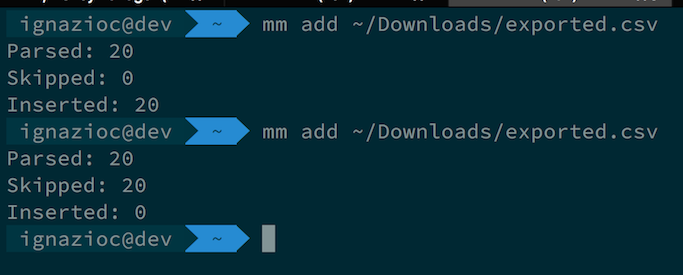
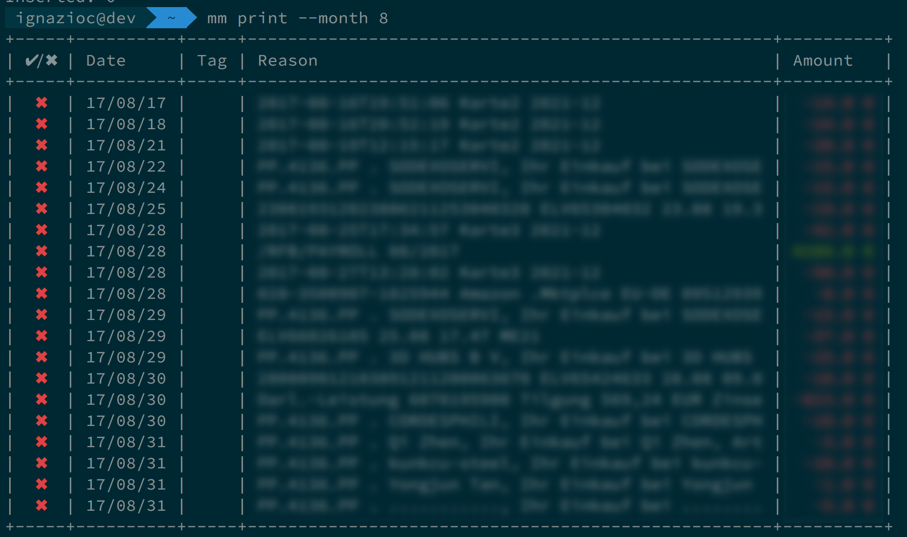
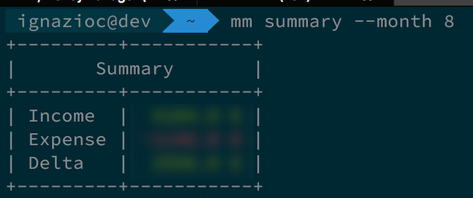
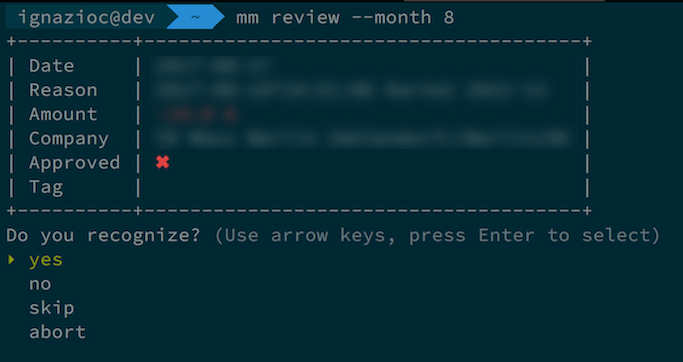
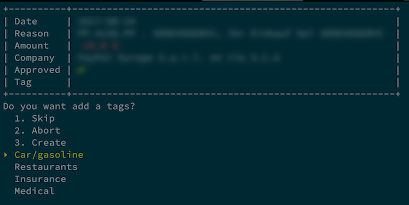
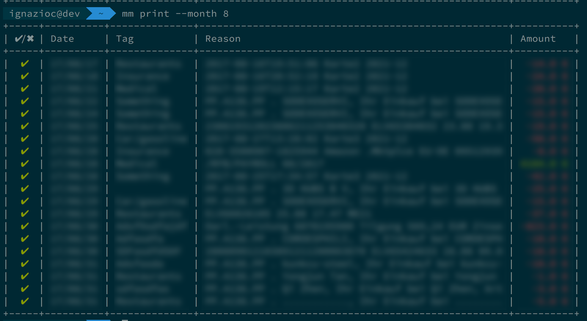

# Moneymanager

This is ruby app I wrote to help me managing my personal finance. Some features are still missing, I'll add in the future.
I ended up writing my own tool instead of using MoneyWiz et simila is that all the tools I tried are either overcomplicated or dont'have the basic information I need (and also because I like writing Ruby code)

## Features

* Import transactions from a `CSV - CAMT` file. I'm not sure about your bank, but SparkasseBerlin has this option.
* The import process is idempotent. I don't wanna have trouble because I imported twice the same file.
* Print the list of transacions filtered by months.
* Review the transaction and flag all the approved ones.
* Tag the transaction and assign a tag to each one
* Print the summary of income/expense.

## Why you shouldn't use this

* The database is just a plain, non-encrypted file. 
* There are no fancy charts. Basic text reports like "How much did I spend in gasoline last month?" are planned for the next release.
* The `print/review/tag` taks are _monthly_ based. If you have undreds of transaction per month using this tool can be tedious.
* 

## Usage

### 1. Install the gem

	$ gem install moneymanager

### 2. Import your CSV FILE

	$ mm add exported.csv

### 3. Print the transactions

	$ mm print --month 8

### 4. Print a minimalist summary

	$ mm summary --month 8

### 5. Review and approve the transactions

	$ mm review --month 8

### 6. Assign a tag to each of the transactions

	$ mm tag --month 8

### 7. Enjoi the list of transaction approved and categorized

	$ mm print --month 8

## Next release

* Add basic report for each tag.
* Multiple tags

## Contributing

Bug reports and pull requests are welcome on GitHub at https://github.com/ignazioc/moneymanager. This project is intended to be a safe, welcoming space for collaboration, and contributors are expected to adhere to the [Contributor Covenant](http://contributor-covenant.org) code of conduct.

## License

The gem is available as open source under the terms of the [MIT License](http://opensource.org/licenses/MIT).

